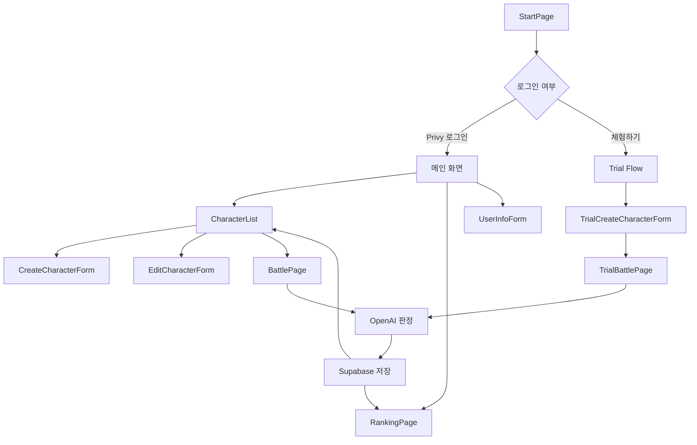

# MonArena (Text Battle)

Monad Testnet 기반 텍스트 배틀 아레나입니다. 사용자는 지갑/Privy로 로그인하고, 자신만의 캐릭터를 만든 뒤 다른 캐릭터와 배틀할 수 있습니다. 배틀 결과는 OpenAI 판정 로직으로 생성되고, 전적과 랭킹은 Supabase에 저장됩니다.

## 목차

- [프로젝트 개요](#프로젝트-개요)
- [주요 기능](#주요-기능)
- [기술 스택](#기술-스택)
- [프로젝트 구조](#프로젝트-구조)
- [실행 방법](#실행-방법)
- [환경 변수](#환경-변수)
- [앱 동작 흐름](#앱-동작-흐름)
- [Supabase 데이터 구조](#supabase-데이터-구조)
- [OpenAI 프록시 구조](#openai-프록시-구조)
- [Monad / 스마트 컨트랙트](#monad--스마트-컨트랙트)
- [배포](#배포)
- [개발 스크립트](#개발-스크립트)
- [운영 체크리스트](#운영-체크리스트)

## 프로젝트 개요

MonArena는 캐릭터 설정과 세계관을 기반으로 AI가 승패를 판정하는 텍스트 배틀 게임입니다.

핵심 흐름은 다음과 같습니다.

1. 사용자가 Privy로 로그인하거나 체험 모드로 진입합니다.
2. 캐릭터 이름과 설명을 입력해 배틀 캐릭터를 생성합니다.
3. 배틀 화면에서 랜덤 상대 캐릭터와 매칭됩니다.
4. OpenAI 판정 로직이 두 캐릭터의 설정을 비교해 승패, 전투 로그, 최종 판정을 생성합니다.
5. 결과가 Supabase에 저장되고 캐릭터 전적, TP, 랭킹이 갱신됩니다.
6. 랭킹 화면에서 티어별 캐릭터 순위를 확인합니다.

## 주요 기능

### 인증 및 사용자 관리

- Privy 기반 로그인
- 지갑 주소 기반 사용자 식별
- 닉네임 저장 및 수정
- 게스트/체험 플로우 지원
- 로그아웃 및 계정 삭제 흐름

### 캐릭터 관리

- 캐릭터 생성, 수정, 삭제
- 계정당 최대 캐릭터 수 제한
- 캐릭터 이름과 설명 기반 배틀 판정
- 일반 전적과 연습 전적 분리
- 캐릭터별 TP, 티어, 랭킹 정보 관리

### 배틀 시스템

- 랜덤 상대 매칭
- AI 기반 승패 판정
- 배틀 로그 및 최종 판정 저장
- 승/패/무 전적 갱신
- 랭크 배틀과 연습 배틀 구분
- 배틀 중복 실행 방지
- 쿨다운 타이머 처리
- 체험 유저 무료 배틀 제한

### 랭킹

- 티어별 캐릭터 랭킹 조회
- TP와 전적 기반 정렬
- 캐릭터 소유자 닉네임 표시
- Supabase 조인 대신 수동 병합 방식 사용

### Monad Testnet 연동

- Monad Testnet 체인 설정
- Wagmi, Viem, TanStack Query 기반 Web3 Provider 구성
- MON 잔액 조회
- Foundry 기반 BattleArena 컨트랙트 소스 포함

## 기술 스택

| 영역 | 기술 |
| --- | --- |
| Frontend | React 19, TypeScript, Vite |
| Auth | Privy |
| Web3 | Wagmi, Viem, RainbowKit, TanStack Query |
| Database | Supabase |
| AI 판정 | OpenAI API, `gpt-4o-mini` |
| Styling | Vanilla CSS |
| Smart Contract | Solidity, Foundry |
| Deployment | Vercel |

## 프로젝트 구조

```text
.
├── api/
│   └── openai-proxy.ts          # Vercel 배포용 OpenAI 프록시
├── contracts/
│   └── src/
│       └── BattleArena.sol      # Monad Testnet용 배틀 컨트랙트
├── public/
│   ├── MON_Token.png
│   ├── monad.svg
│   └── monad_favicon.png
├── src/
│   ├── components/
│   │   ├── BattlePage.tsx
│   │   ├── BottomNav.tsx
│   │   ├── CharacterList.tsx
│   │   ├── CreateCharacterForm.tsx
│   │   ├── EditCharacterForm.tsx
│   │   ├── Header.tsx
│   │   ├── RankingPage.tsx
│   │   ├── StartPage.tsx
│   │   ├── TrialBattlePage.tsx
│   │   ├── TrialCreateCharacterForm.tsx
│   │   ├── TrialEditCharacterForm.tsx
│   │   └── UserInfoForm.tsx
│   ├── lib/
│   │   ├── openai.ts            # AI 배틀 판정 로직
│   │   └── supabaseClient.ts    # Supabase 클라이언트
│   ├── types/
│   │   └── character.ts         # 캐릭터 타입
│   ├── App.tsx
│   └── main.tsx
├── foundry.toml                 # Foundry 설정
├── package.json
├── vercel.json                  # SPA fallback 및 OpenAI 프록시 rewrite
└── vite.config.ts               # Vite dev server OpenAI 프록시
```

## 실행 방법

### 1. 의존성 설치

이 프로젝트는 `package-lock.json`을 포함하므로 npm 사용을 권장합니다.

```bash
npm install
```

### 2. 환경 변수 설정

프로젝트 루트에 `.env.local` 파일을 생성합니다.

```env
VITE_SUPABASE_URL=your_supabase_project_url
VITE_SUPABASE_ANON_KEY=your_supabase_anon_key
VITE_PRIVY_APP_ID=your_privy_app_id

# 서버/프록시에서만 사용합니다. VITE_ 접두사를 붙이지 마세요.
OPENAI_API_KEY=your_openai_api_key

# Foundry에서 Monad Explorer 검증을 사용할 때만 필요합니다.
MONAD_EXPLORER_API_KEY=your_monad_explorer_api_key
```

### 3. 개발 서버 실행

```bash
npm run dev
```

기본 Vite 주소는 다음과 같습니다.

```text
http://localhost:5173
```

### 4. 프로덕션 빌드

```bash
npm run build
```

### 5. 빌드 결과 미리보기

```bash
npm run preview
```

## 환경 변수

| 변수 | 필수 | 사용 위치 | 설명 |
| --- | --- | --- | --- |
| `VITE_SUPABASE_URL` | 예 | Frontend | Supabase 프로젝트 URL |
| `VITE_SUPABASE_ANON_KEY` | 예 | Frontend | Supabase anon key |
| `VITE_PRIVY_APP_ID` | 예 | Frontend | Privy 앱 ID |
| `OPENAI_API_KEY` | 예 | Vite proxy, Vercel API | OpenAI API 호출용 서버 환경 변수 |
| `MONAD_EXPLORER_API_KEY` | 선택 | Foundry | 컨트랙트 검증용 Monad Explorer API key |

`OPENAI_API_KEY`는 클라이언트 번들에 노출되면 안 됩니다. 현재 구조에서는 개발 환경에서 Vite proxy가 헤더를 주입하고, 배포 환경에서는 Vercel serverless proxy가 API 요청을 중계합니다.

## 앱 동작 흐름



### 일반 사용자 플로우

1. `StartPage`에서 Privy 로그인을 진행합니다.
2. `App.tsx`가 로그인 상태와 사용자 정보를 확인합니다.
3. 신규 사용자는 `users` 테이블에 사용자 정보를 저장합니다.
4. `CharacterList`에서 기존 캐릭터를 확인하거나 새 캐릭터를 생성합니다.
5. `BattlePage`에서 상대를 매칭하고 배틀을 시작합니다.
6. 결과가 `characters`, `battles`, `users` 테이블에 반영됩니다.
7. `RankingPage`에서 티어별 랭킹을 확인합니다.

### 체험 플로우

1. 로그인 없이 체험하기로 진입합니다.
2. `TrialCreateCharacterForm`에서 임시 캐릭터를 생성합니다.
3. `TrialBattlePage`에서 무료 체험 배틀을 진행합니다.
4. 체험 배틀 횟수 제한에 도달하면 로그인 안내를 표시합니다.

## Supabase 데이터 구조

현재 코드가 참조하는 주요 테이블은 다음과 같습니다.

| 테이블 | 역할 |
| --- | --- |
| `users` | 사용자 ID, 지갑 주소, 닉네임, 티켓, 사용자 전적 관리 |
| `characters` | 캐릭터 정보, 소유자, 전적, TP, 티어 관리 |
| `battles` | 배틀 참가자, 결과, 로그, 최종 판정 저장 |

### `characters` 주요 필드

| 필드 | 설명 |
| --- | --- |
| `character_id` | 캐릭터 기본 키 |
| `user_id` | Privy 사용자 ID 또는 내부 사용자 ID |
| `owner_wallet_address` | 캐릭터 소유자 지갑 주소 |
| `character_name` | 캐릭터 이름 |
| `character_description` | 캐릭터 설명 및 설정 |
| `win_count` | 랭크 승리 수 |
| `lose_count` | 랭크 패배 수 |
| `draw_count` | 랭크 무승부 수 |
| `battle_count` | 랭크 총 배틀 수 |
| `practice_win_count` | 연습 승리 수 |
| `practice_lose_count` | 연습 패배 수 |
| `practice_draw_count` | 연습 무승부 수 |
| `practice_battle_count` | 연습 총 배틀 수 |
| `rank_tier` | 현재 티어 |
| `tp` | 티어 포인트 |
| `rank_ticket` | 랭크 게임 입장권 보유 여부 |
| `last_battle_at` | 마지막 배틀 시간 |
| `created_at` | 생성 시간 |

### `users` 주요 필드

| 필드 | 설명 |
| --- | --- |
| `user_id` | 사용자 식별자 |
| `wallet_address` | 지갑 주소 |
| `nickname` | 랭킹/프로필에 표시할 닉네임 |
| `ticket` | 랭크 티켓 수량 또는 보유 상태 |
| `created_at` | 생성 시간 |
| `updated_at` | 수정 시간 |

### `battles` 주요 필드

| 필드 | 설명 |
| --- | --- |
| `challenger_character_id` | 도전자 캐릭터 ID |
| `defender_character_id` | 상대 캐릭터 ID |
| `challenger_user_id` | 도전자 사용자 ID |
| `defender_user_id` | 상대 사용자 ID |
| `result` | `challenger_win`, `defender_win`, `draw` 중 하나 |
| `battle_log` | AI가 생성한 배틀 로그 |
| `final_verdict` | 최종 판정 문구 |
| `is_practice` | 연습 배틀 여부 |
| `created_at` | 생성 시간 |
| `finished_at` | 종료 시간 |

> 실제 운영 전에는 Supabase RLS 정책을 반드시 설정해야 합니다. 특히 `characters`, `users`, `battles` 쓰기 권한은 사용자 본인 데이터만 수정 가능하도록 제한하는 것이 좋습니다.

## OpenAI 프록시 구조

OpenAI API key는 브라우저에 노출되면 안 되기 때문에 직접 호출하지 않고 `/api-openai` 경로를 통해 중계합니다.

### 개발 환경

`vite.config.ts`에서 `/api-openai` 요청을 OpenAI API로 프록시합니다.

```text
Frontend -> /api-openai/... -> Vite dev proxy -> https://api.openai.com/v1/...
```

Vite dev server는 `.env.local`의 `OPENAI_API_KEY`를 읽어 `Authorization` 헤더를 추가합니다.

### 배포 환경

`vercel.json`은 `/api-openai/(.*)` 요청을 `api/openai-proxy.ts`로 rewrite합니다.

```text
Frontend -> /api-openai/... -> Vercel Function -> OpenAI API
```

`api/openai-proxy.ts`는 `process.env.OPENAI_API_KEY`를 사용해 OpenAI API에 요청을 전달합니다.

## AI 배틀 판정

`src/lib/openai.ts`의 `adjudicateBattle` 함수가 배틀 판정의 중심입니다.

판정 로직은 다음 정보를 사용합니다.

- 도전자 캐릭터 이름
- 도전자 캐릭터 설명
- 상대 캐릭터 이름
- 상대 캐릭터 설명
- 배틀 모드와 결과 저장에 필요한 메타데이터

OpenAI 응답은 배틀 결과, 전투 로그, 최종 판정으로 가공되어 UI와 Supabase 저장 로직에서 사용됩니다.

현재 모델 참조는 `gpt-4o-mini`입니다.

## Monad / 스마트 컨트랙트

### Monad Testnet 설정

`src/main.tsx`에서 Monad Testnet 체인을 정의합니다.

| 항목 | 값 |
| --- | --- |
| Chain ID | `10143` |
| Native Token | `MON` |
| RPC URL | `https://testnet-rpc.monad.xyz` |
| Explorer | `https://testnet.monadexplorer.com` |

### BattleArena 컨트랙트

컨트랙트 소스는 `contracts/src/BattleArena.sol`에 있습니다.

주요 함수는 다음과 같습니다.

| 함수 | 설명 |
| --- | --- |
| `enterBattle` | 배틀 참가 |
| `claimReward` | 보상 청구 |
| `setSigner` | 결과 서명자 변경 |
| `withdraw` | 컨트랙트 잔액 출금 |
| `recoverSigner` | 서명 검증용 signer 복구 |

Foundry 설정은 `foundry.toml`에 정의되어 있습니다.

```bash
forge build
```

현재 저장소에는 별도 배포 스크립트와 컨트랙트 테스트 파일이 포함되어 있지 않습니다. 배포 자동화가 필요하면 `contracts/script`와 `contracts/test`를 추가하면 됩니다.

## 배포

Vercel 배포를 기준으로 구성되어 있습니다.

1. Vercel 프로젝트를 생성합니다.
2. 환경 변수에 다음 값을 등록합니다.
   - `VITE_SUPABASE_URL`
   - `VITE_SUPABASE_ANON_KEY`
   - `VITE_PRIVY_APP_ID`
   - `OPENAI_API_KEY`
3. Build Command는 기본값 또는 아래 명령을 사용합니다.

```bash
npm run build
```

4. Output Directory는 Vite 기본 빌드 결과인 `dist`를 사용합니다.

`vercel.json`은 SPA 라우팅을 위해 모든 일반 요청을 `/index.html`로 보내고, OpenAI 요청만 serverless proxy로 보냅니다.

## 개발 스크립트

| 명령어 | 설명 |
| --- | --- |
| `npm run dev` | Vite 개발 서버 실행 |
| `npm run build` | TypeScript 빌드 후 Vite 프로덕션 빌드 |
| `npm run lint` | ESLint 검사 |
| `npm run preview` | 빌드 결과 미리보기 |
| `forge build` | Solidity 컨트랙트 컴파일 |

## 운영 체크리스트

- [ ] Supabase URL과 anon key 설정
- [ ] Supabase RLS 정책 설정
- [ ] Privy 앱 ID 설정
- [ ] OpenAI API key를 서버 환경 변수로만 설정
- [ ] Vercel 환경 변수 등록
- [ ] Monad Testnet 지갑 연결 테스트
- [ ] 배틀 생성, 결과 저장, 랭킹 갱신 확인
- [ ] 체험 배틀 제한 동작 확인
- [ ] 컨트랙트 배포 주소와 ABI 연동 여부 확정

## 참고 사항

- 현재 앱 이름은 패키지 기준으로 `text-battle`, 저장소/서비스 기준으로는 `MonArena`를 사용합니다.
- OpenAI API key는 절대 `VITE_` 접두사로 만들지 마세요.
- Supabase schema migration 파일은 저장소에 포함되어 있지 않으므로, 운영 DB schema는 코드가 참조하는 컬럼과 맞춰 별도로 관리해야 합니다.
- 컨트랙트 소스는 포함되어 있지만, 프론트엔드에서 사용할 최종 배포 주소와 ABI 연동은 별도 확인이 필요합니다.
